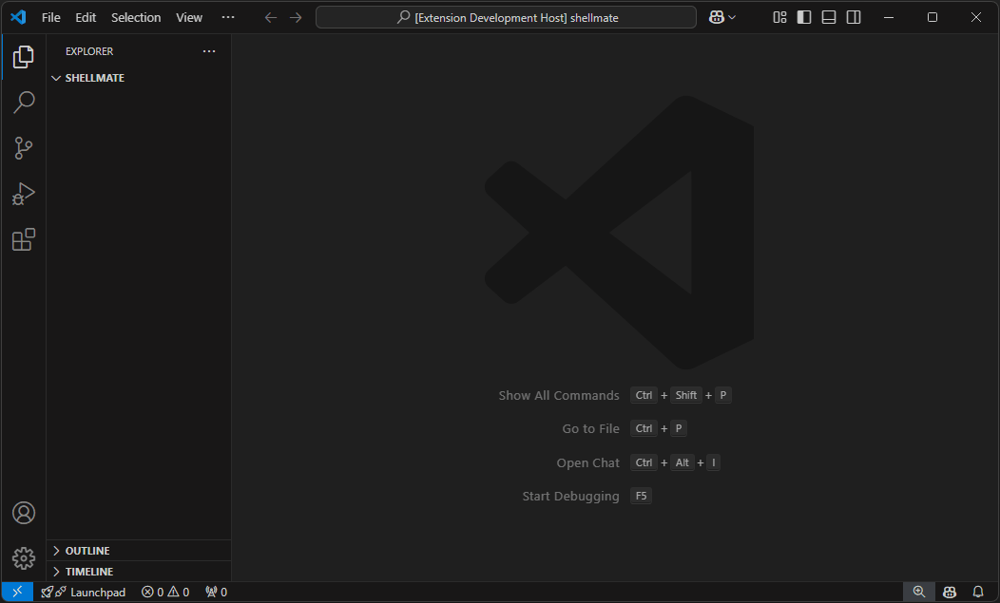
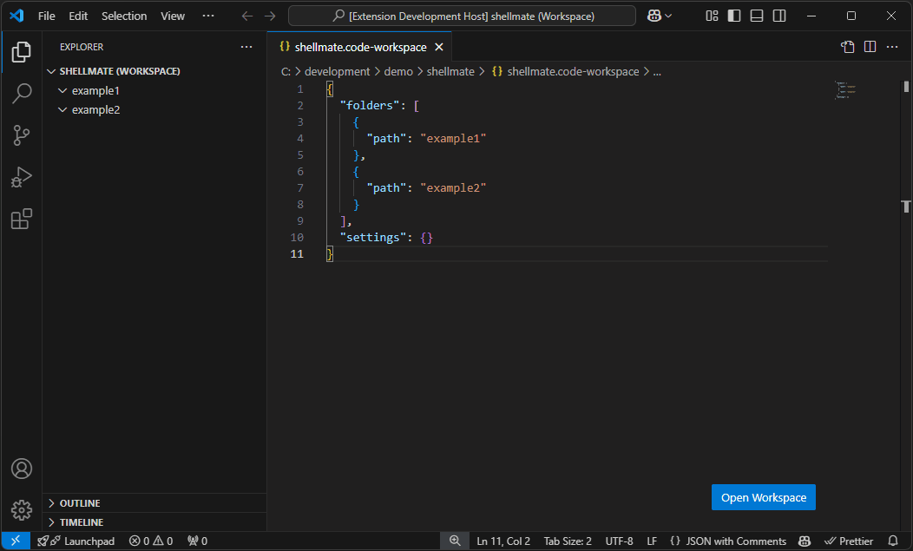

# ShellMate

Single root project:



Multi root project:



## Description

ShellMate is a terminal manager extension for vscode.

Right now this extension differ between single and multi root projects. For single root projects the configuration will always be stored within the `.vscode` folder.

For multi root projects you can choose a custom path (without the name of the settings file). This location will be stored within the `.code-workspace` file.

## Features

- Create as many terminals as you want
- Create split terminals
- Auto create terminals on vscode startup
- Auto execute commands
- Define where the config file should be stored
- Works for single root and multi root projects

## Installation

Get it from [Visual Studio Marketplace](https://marketplace.visualstudio.com/items?itemName=Dawosch.shellmate)

## Config example

```typescript
{
  // Create terminals on vscode startup
  autostart: boolean,

  // Terminal definitions
  terminals: [
    // Single terminal definition
    {
      name: string,
      icon: string
    },

    // Split terminal definition
    [
      {
        name: string,
        icon: string
      },
      {
        name: string,
        icon: string
      },
    ],
  ],
};
```

## Terminal options

```typescript
{
  // A humas readable string (optional)
  name?: string;

  // An id of the icon. All available icons can be found here: https://code.visualstudio.com/api/references/icons-in-labels#icon-listing
  icon?: string;

  // A path to a custom shell executable. Aliases can be used here too
  shellPath?: string;

  // Args for the custom shell executable. A string can be used on Windows only which allows specifying shell args in command-line format.
  shellArgs?: string[];

  // The command which should be executed after the terminal was created
  command?: string;

  // A path or Uri for the current working directory to be used for the terminal
  cwd?: string;

  // An object with environment variables that will be added to the editor process
  env?: { [key: string]: string | undefined };

  // A message to write to the terminal on first launch, note that this is not sent to the process but, rather written directly to the terminal. This supports escape sequences such a setting text style
  message?: string;
}
```

## Extension Settings

This extension contributes one setting, but it's not used for global usage.

## Known Issues

Fell free to [create an issue](https://github.com/dawosch/shellmate) when you find a bug

## Release Notes

### 0.0.5

- Error message on startup fixed #2
- Enable and disable autostart fixed 

### 0.0.4

- Error message on startup fixed

### 0.0.3

- Config creation process changed
- Readme updated
- Some smaler bugfixes

### 0.0.2

- Logo added

### 0.0.1

- Initial release
